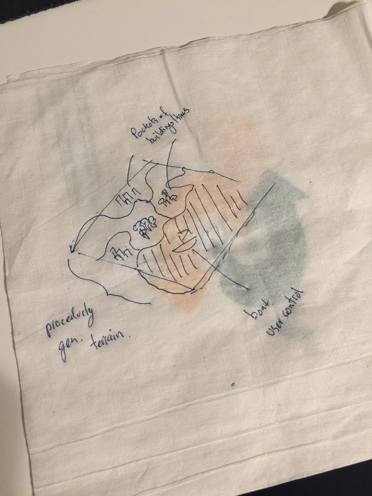
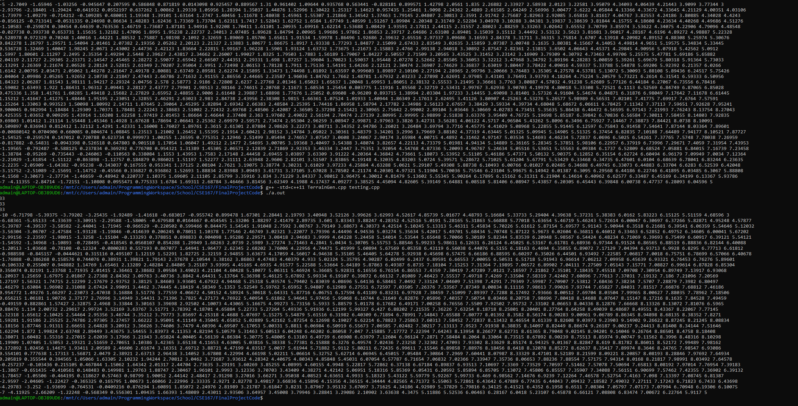
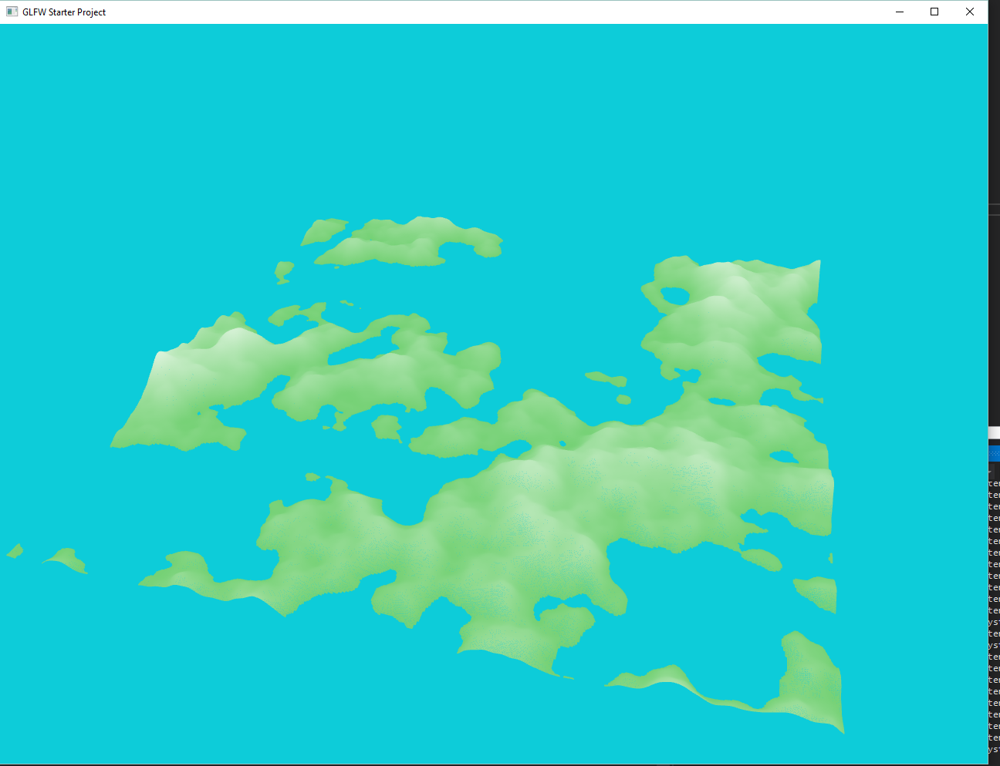
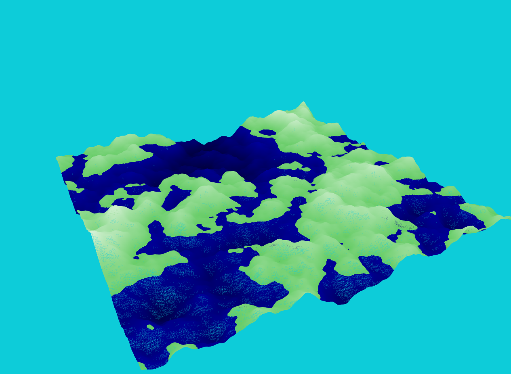
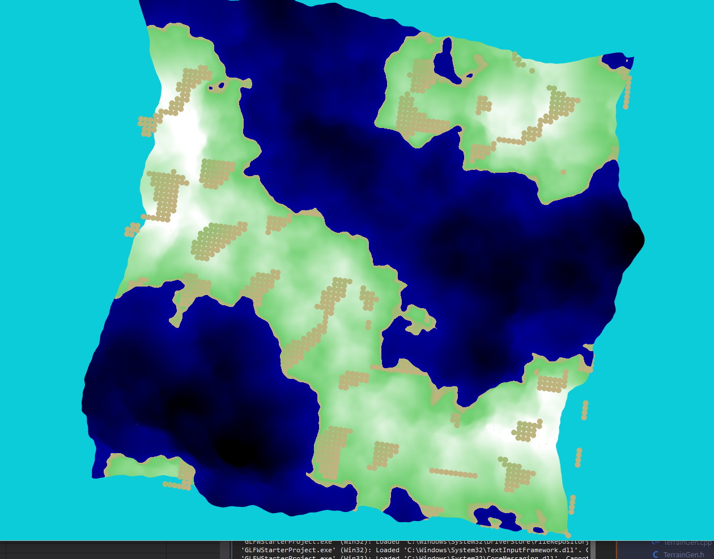
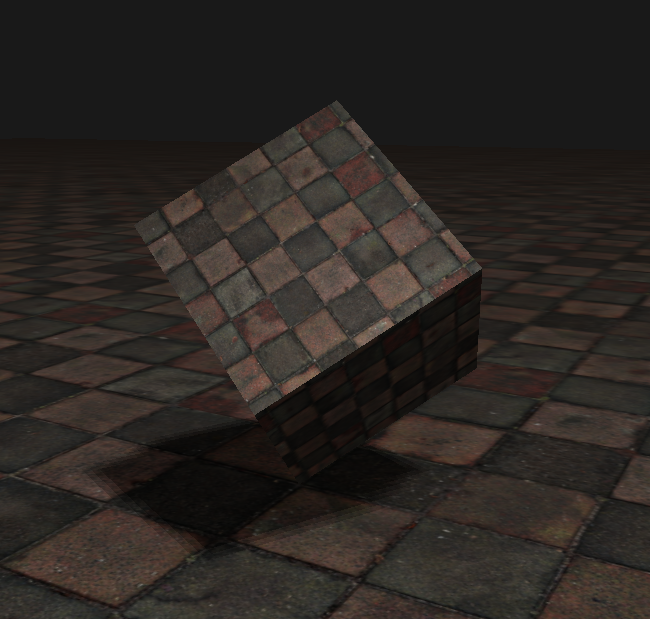

# CSE 167 Final Project Project 'Water and Boats'

## Table of Contents
- [Blog Post 1](#blog-post-1)
- [Blog Post 2](#blog-post-2)
- [Blog Post 3](#blog-post-3)

<a name="blog-post-1"/>

## Blog Post 1

### Project Members

- Alan Mai
- Xiuyuan Chen

### Project Description

Create a procedurly generated water based lanscape where you can control a variety of different boats in the water. On the land, there will be random cities and forests, creating a nice landscape to sail around.

### Technical Details

- Procedurly generated landscape (2 points)
- Shadow mapping (2 points)
- Water effect with reflection and refraction (2 points)
  - Water effect with reflection of 3D models (EC if able)
  
### Creative Efforts

- Boat moving in the water to trigger water animations (or even control the boat)
  - larger/smaller waves depending on the speed of the boat
- Boat controls with interesting camera positions
- Adding buildings and shrubbery in an aesthetically pleasing manner on top of random terrain.
  - add in plants/buildings under the water? Similar to a flooded environment

### Sketch

<a name="blog-post-2"/>

## Blog Post 2

No changes to above. Style aims to be more cartoony style, and might incorperate toon shading, flat colors, etc. Wind Waker as a reference of possible target style.

### Work done for the week

Worked on terrain generation.
- Finished diamond-square algorithm 
- Have not yet finished the rendering of the terrain. (Bug leading to nothing being rendered)

#### console output of the hight grid generated by diamond-square algorithm

Note: this is because we were yet unable to render the terrain properly yet.

<a name="blog-post-3"/>

## Blog Post 3

We are working on seperate features independently and we are hoping to combine our scene tonight.

### Work done for the week
Diamond-square algorithm has an inherent design flaw that leads to regular "peaks" or "dimples". Changed to use Perlin noise generated terrain instead, which creates much smoother hills without the same flaws seen in diamond-square.

Balls represent possible locations for placing trees

We have finished shadow mapping. We have the shader and render logics ready and tested it on a scene.

